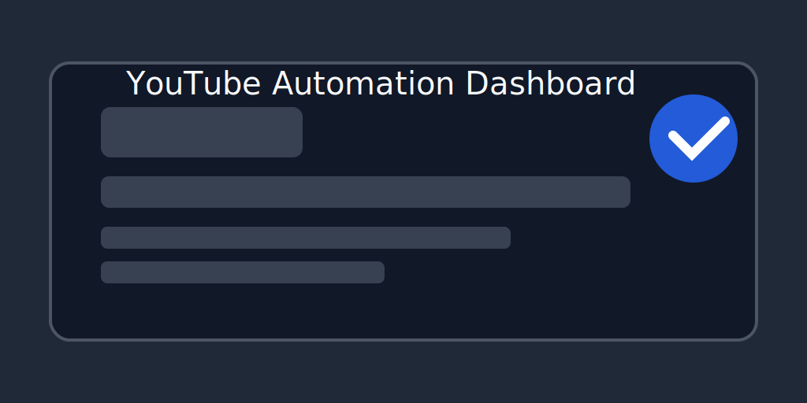

# YouTube Automation

A full-stack platform for automated YouTube channel management, AI-powered video creation, and publishing orchestration.

## Features

- Automated channel and video workflow management
- AI-powered content generation and thumbnail automation
- FastAPI backend with Redis, Celery, and PostgreSQL support
- React + Vite frontend dashboard
- Docker Compose development stack
- GitHub Actions CI workflow for backend tests and frontend lint

## Installation

### Prerequisites

- Python 3.13
- Node.js 20+
- Docker and Docker Compose
- Git

### Setup with Docker

1. Copy environment templates:

```bash
copy .env.example .env
copy backend\.env.example backend\.env
copy frontend\.env.example frontend\.env
```

2. Update values in `backend/.env` and `frontend/.env`.
3. Start the stack:

```bash
docker-compose up --build
```

### Local development

#### Backend

```bash
cd backend
python -m venv .venv
.venv\Scripts\activate
pip install -r requirements-dev.txt
pytest -q
```

#### Frontend

```bash
cd frontend
npm install
npm run dev
```

## Usage

- Backend API: `http://localhost:8000`
- OpenAPI docs: `http://localhost:8000/docs`
- Frontend app: `http://localhost:5173`

Use the provided `.env.example` files to configure API endpoints, secrets, and storage providers.

## Screenshots



> Replace this placeholder with real UI screenshots once the app is running.

## License

Released under the MIT License. See [LICENSE](LICENSE) for details.

## Repository

This project is configured for public GitHub publishing with a CI workflow and clean ignore rules.
